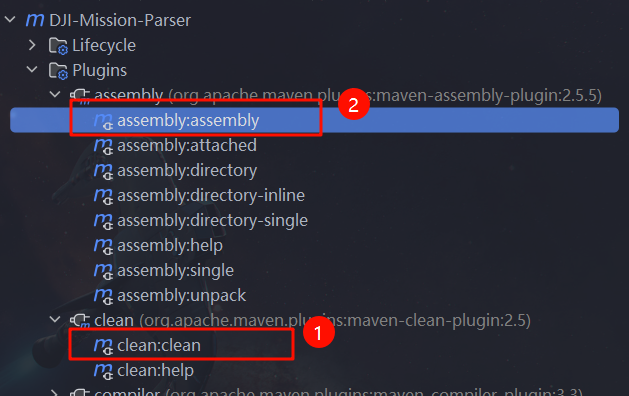

[English](README.md) 中文版

# DJI-Mission-Parser 针对大疆航线wpml文件与javabean对象互转的jar包

`DJI-Mission-Parser`是一个提供大疆航线文件与javabean对象互相转换的工具，依据的标准为[Cloud API (dji.com)](https://developer.dji.com/doc/cloud-api-tutorial/cn/api-reference/dji-wpml/overview.html)提供的航线格式文档，可用于大疆[Cloud API (dji.com)](https://developer.dji.com/doc/cloud-api-tutorial/cn/)绘制大疆航线功能的开发。

**主要功能**

目前，`DJI-Mission-Parser`主要提供以下方法:

* **航线参数与javabean对象映射**
* **javabean转航线文件**: 
* **航线文件转javabean**

## 安装

DJI-Mission-Parser使用JDK 17进行编译运行。

### 用Maven安装

#### 克隆项目

```sh
git clone https://github.com/hqzqaq/DJI-Mission-Parser.git
```

#### 编译

在安装 `DJI-Mission-Parser`之前，请确保已经安装了Maven：[Maven – Download Apache Maven](https://maven.apache.org/download.cgi)
如果你已经安装了Maven，则直接编译项目即可：



在target目录会出现一个dji-mission-parser-1.0.jar的jar包

#### 安装到本地maven仓库

编译之后，可以直接在项目中引用jar包或者安装到本地的maven仓库，用maven的方式引用，下面介绍maven的方式引用：

    mvn install:install-file -DgroupId=cn.beidou.scnu -DartifactId=dji-mission-parser -Dversion=1.0 -Dfile=dji-mission-parser-1.0.jar -Dpackaging=jar

需要注意的是：`-Dfile=[jar包的路径]`

#### maven依赖引入

```xml
<dependencies>
    <dependency>
        <groupId>cn.beidou.scnu</groupId>
        <artifactId>dji-mission-parser</artifactId>
        <version>1.0</version>
    </dependency>
</dependencies>
```

## 使用示例

### javabean转文件

下面例子展示如何使用 `DJI-Mission-Parser`工具将javabean对象转换为航线文件

```java
public class GererateKml {

    public static void main(String[] args) throws JAXBException, ParserConfigurationException, SAXException {
        String path = "./data";
        File saveFolder = new File(path);
        if (!saveFolder.exists()) {
            saveFolder.mkdirs();
        }
        XmlUtil.objectToXML(buildMission(), Paths.get(path, "template.kml").toString());
    }

    public static Kml buildMission() {
        Kml kml = new Kml();
        Document document = new Document();
        MissionConfig missionConfig = new MissionConfig();
        missionConfig.setFlyToWaylineMode("safely");
        missionConfig.setFinishAction("goHome");
        missionConfig.setExitOnRCLost("executeLostAction");
        missionConfig.setExecuteRCLostAction("goBack");
        missionConfig.setTakeOffSecurityHeight(50D);

        missionConfig.setTakeOffRefPoint("23.148073,113.022773,23.300000");
        missionConfig.setTakeOffRefPointAGLHeight(0D);

        missionConfig.setGlobalTransitionalSpeed(10D);
        missionConfig.setGlobalRTHHeight(70);
        document.setMissionConfig(missionConfig);

        // missionConfig.setGlobalTransitionalSpeed(10D);
        // missionConfig.setGlobalRTHHeight(60);
        DroneInfo droneInfo = new DroneInfo(67, 1);
        PayloadInfo payloadInfo = new PayloadInfo(53, 0, 0);
        missionConfig.setDroneInfo(droneInfo);
        missionConfig.setPayloadInfo(payloadInfo);

        Folder folder = new Folder();
        folder.setTemplateId(0);
        folder.setTemplateType("waypoint");


        WaylineCoordinateSysParam waylineCoordinateSysParam = new WaylineCoordinateSysParam();
        waylineCoordinateSysParam.setCoordinateMode("WGS84");
        waylineCoordinateSysParam.setHeightMode("relativeToGround");
        folder.setWaylineCoordinateSysParam(waylineCoordinateSysParam);

        folder.setAutoFlightSpeed(10D);
        folder.setGlobalHeight(70D);
        folder.setCaliFlightEnable(0);
        folder.setGimbalPitchMode("usePointSetting");

        folder.setExecuteHeightMode("relativeToStartPoint");


        folder.setGlobalWaypointTurnMode("toPointAndStopWithDiscontinuityCurvature");
        folder.setGlobalUseStraightLine(1);

        Placemark placemark1 = new Placemark();
        Point point = new Point();
        point.setCoordinates("113.02284812154,23.1479920050768");
        placemark1.setPoint(point);
        placemark1.setIndex(0);
        placemark1.setExecuteHeight(70D);
        placemark1.setWaypointSpeed(10D);
        WaypointHeadingParam waypointHeadingParam = new WaypointHeadingParam();
        waypointHeadingParam.setWaypointHeadingMode("followWayline");
        waypointHeadingParam.setWaypointHeadingAngle(0);
        waypointHeadingParam.setWaypointPoiPoint("0.000000,0.000000,0.000000");
        waypointHeadingParam.setWaypointHeadingAngleEnable(0);
        waypointHeadingParam.setWaypointHeadingPathMode("followBadArc");
        waypointHeadingParam.setWaypointHeadingPoiIndex(0);
        placemark1.setWaypointHeadingParam(waypointHeadingParam);

        WaypointTurnParam waypointTurnParam = new WaypointTurnParam();
        waypointTurnParam.setWaypointTurnMode("toPointAndStopWithDiscontinuityCurvature");
        waypointTurnParam.setWaypointTurnDampingDist(0D);
        placemark1.setWaypointTurnParam(waypointTurnParam);
        placemark1.setUseStraightLine(1);

        ActionGroup actionGroup = new ActionGroup();
        actionGroup.setActionGroupId(1);
        actionGroup.setActionGroupStartIndex(0);
        actionGroup.setActionGroupEndIndex(0);
        actionGroup.setActionGroupMode("sequence");
        ActionTrigger actionTrigger = new ActionTrigger();
        actionTrigger.setActionTriggerType("reachPoint");
        actionGroup.setActionTrigger(actionTrigger);

        Action action = new Action();
        action.setActionId(0);
        action.setActionActuatorFunc("takePhoto");
        ActionActuatorFuncParam actionActuatorFuncParam = new ActionActuatorFuncParam();
        actionActuatorFuncParam.setFileSuffix("Waypoint1");
        actionActuatorFuncParam.setPayloadPositionIndex(0);
        actionActuatorFuncParam.setUseGlobalPayloadLensIndex(1);
        actionActuatorFuncParam.setPayloadLensIndex("ir,wide,zoom");

        List<ActionGroup> actionGroups = new ArrayList<>();
        actionGroups.add(actionGroup);
        placemark1.setActionGroup(actionGroups);

        List<Placemark> placemarks = new ArrayList<>();
        placemarks.add(placemark1);
        folder.setPlacemark(placemarks);
        document.setFolder(folder);
        kml.setDocument(document);
        return kml;
    }
}
```

### kml或wpml转javabean

```java
public class ReadKml {
    public static void main(String[] args) throws JAXBException {
        String path = "./data/wpmz/waylines.wpml";
        Kml kml = readKmlContent(path);
        System.out.println(XmlUtil.objectToXML(kml));
    }

    public static Kml readKmlContent(String kmlPath) throws JAXBException {
        File kmlFile = new File(kmlPath);
        if (!kmlFile.exists()) {
            return null;
        }
        return XmlUtil.xmlToBean(kmlFile, Kml.class);
    }
}
```

## 相关链接

* 大疆Cloud API航线文件文档： https://developer.dji.com/doc/cloud-api-tutorial/cn/feature-set/dock-feature-set/dock-wayline-management.html
